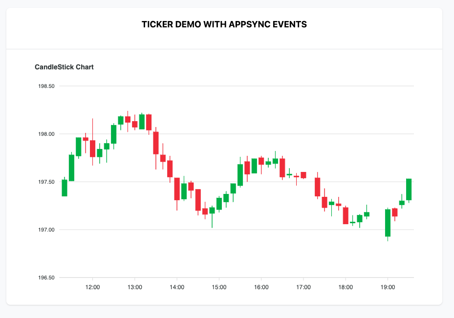
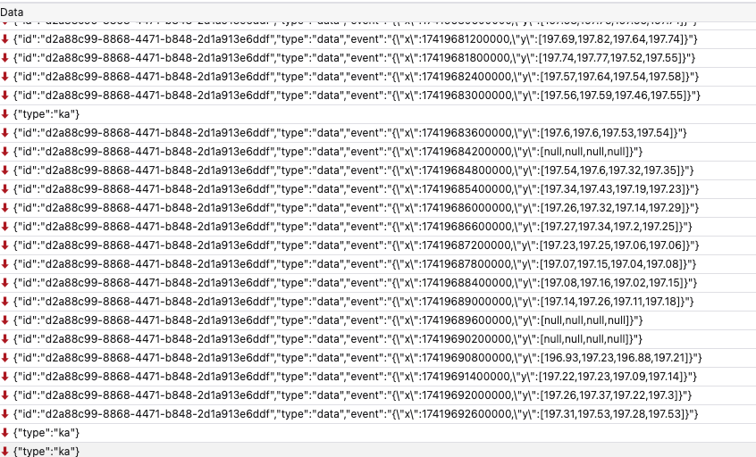

# Ticker demo with AppSync Events

## backend

do this:

```sh
cd stock-ticker-backend
npm install
npm run cdk deploy -- -O output.json
```

## app

```sh
cd stock-ticker-app
cd src
# you must link the file below, it's ignored and not auto commited to the repo
ln -s ../../stock-ticker-backend/output.json .
cd ..
npm install
npm run dev
```

## running the demo

After you've started the app, navigate to the web page, check the WebSocket connection is established.
Start the Lambda function you deployed from the Lambda console; i.e.: just run it in test mode.

In the app you'll see it start to update. ok success.



In the network tab


